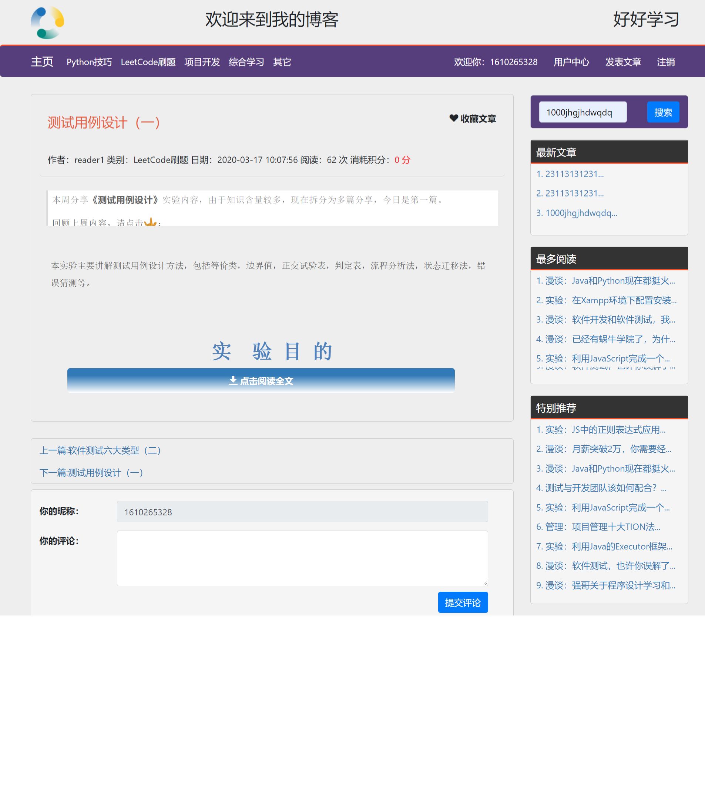

# pythonBlog

### （项目正在完善中,推荐使用pycharm运行该项目）

#### 项目介绍

本项目是一个各方面功能都十分完善的基于flask的博客系统（你如可以邮箱注册、找回密码等功能），十分适合新手学习、搭建博客


#### 运行方式

1. 先在mysql创建名为myBlog名称的数据库 再在数据库运行myBlog.sql语句 完成数据加载
2. 设置constant.py里mysql服务器（在完成第一步的前提下，数据库名称不一定要是myBlog,对应要在配置文件里更改）
3. 运行app.py

#### 登录试验

数据库里有两个默认的账号

- 管理员登录： admin@qq.com(账户)  admin1234（密码）
- 编辑登录： test@qq.com(账户)  test1234(密码)

#### 项目截图




#### 所需要的包

````
在目录下执行以下命令安装需要的包
pip install -r requirements.txt
````

#### 项目特色

1. 超详细的注释，几乎每一段代码包括数据库的字段都有详细的注释
2. 较多技术融合，适合学习，数据库采用mysql以及sqlalchemy，前端有些网页页实现了前后端分离（比如侧边栏和评论）
3. 超详细的log系统，用户的几乎所有操作都可以在log日志中查看（每个用户也都有不同的日志），十分方便系统管理员或用户查看记录
4. 博客功能较齐全，项目包含评论、邮件注册账户、删除评论、推荐文章、收藏文章、栏目分组等功能，可谓“麻雀虽小、五脏俱全”
5. 超全的可自定义性，在constant文件里，列出了超多可改变的参数，比如每天登录送几个积分、没人每天最多评论几次、是否要轮播图、轮播图的网址跳转到哪等等
6. 更新、维护较快，项目正处于开发阶段，预计接下来一个月完善所有功能，作者有问必回（邮箱***jz271381@gmail.com***）
7. 适合新手学习，添加项目经验，本系统是基于flask开发，都是很考验基本功的一些东西，适合拿来练手，并且提升github经验
8. 欢迎参与开发（可联系邮件），或提出你的issue与pr

#### 可能报错

1. urllib 版本过高 建议降低版本 pip install urllib3==1.25.11

#### 版本更新

- 21-12-8 
    - 项目基本可运行，仍存在不少瑕疵
- 21-1-15 
    - 基本可运行
    - 所有文件的注释添加完毕
    - 数据库每个字段说明注释添加完毕
    - 用户后台的main页面写完成
    - 实现了每天自动检测登录、领取积分功能

#### 待完善

- 后台管理系统
- github第三方登录功能
- redis缓存技术
- flask-limiter限制
- flask后台监控