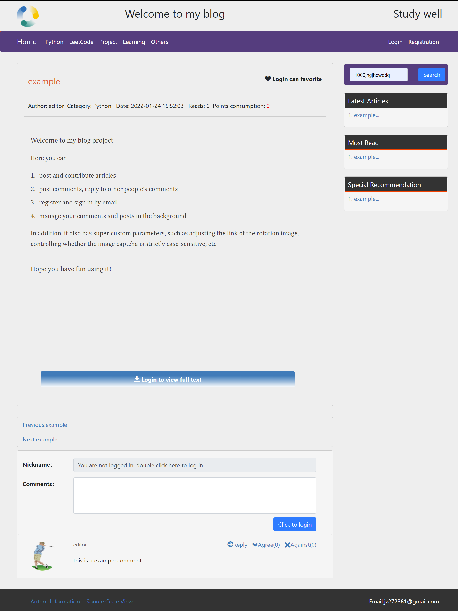

# pythonBlog

### (The project is being improved, it is recommended to use pycharm to run the project)

#### Project Description

This project is a perfect flask-based blog system in all aspects of functionality (you can email registration, password retrieval and other functions), very suitable for newcomers to learn, build a blog


#### running method

1. first create a database named myBlog name in mysql and then run myBlog.sql statement in the database to complete the data loading
2. set up the mysql server in constant.py (under the premise of completing the first step, the database name does not have to be myBlog, it should be changed in the configuration file)
3. run app.py

#### login test

There are two default accounts in the database

- Administrator login: admin@qq.com(account) admin1234(password)
- Edit login: test@qq.com(account) test1234(password)

#### Project screenshot

| Index Page                       | Article Page                       | Post Article                       |
| -------------------------------- | ---------------------------------- | ---------------------------------- |
|  |  |  |

| Manage Page                       | Login Panel                     |
| -------------------------------- | ----------------------------------|
|  | |

#### Required packages

````python
Install the required packages by executing the following command in the directory
pip install -r requirements.txt
````

#### project features

1. super detailed comments, almost every piece of code including the database fields have detailed comments
2. more technical integration, suitable for learning, database using mysql and sqlalchemy, some front-end pages to achieve front and back-end separation (such as sidebar and comments)
3. super detailed log system, almost all operations of the user can be viewed in the log log (each user also has a different log), very convenient for system administrators or users to view records
4. complete blog function, the project contains comments, email registration account, delete comments, recommended articles, favorite articles, column grouping and other functions, can be described as "small, but all the guts"
5. super comprehensive customizability, in the constant file, listed a super number of parameters can be changed, such as daily login to send a few points, no one the maximum number of comments per day, whether to rotate the map, rotate the map URL jump to where, etc.
6. update, maintenance is faster, the project is in the development stage, is expected to improve all the features in the next month, the author has a question will return (email *** jz271381@gmail.com***)
7. suitable for newcomers to learn, add project experience, the system is based on flask development, are very test of basic skills of some things, suitable for practice, and enhance the github experience
8. welcome to participate in the development (can contact email), or raise your issues and pr

#### may report errors

1. urllib version is too high, suggest lowering the version pip install urllib3==1.25.11

#### version update

- 21-12-8 
    - The project is basically working, but there are still many flaws
- 21-1-15 
    - Project is basically running
    - All the comments of the files are added
    - Comments for each field of the database are added
    - The main page of user background is written.
    - Implemented daily auto-detection of login and points collection function

#### to be improved

- Backend management system
- github third party login function
- redis caching technology
- flask-limiter limit
- flask backend monitoring
*** Translated with www.DeepL.com/Translator (free version) ***

