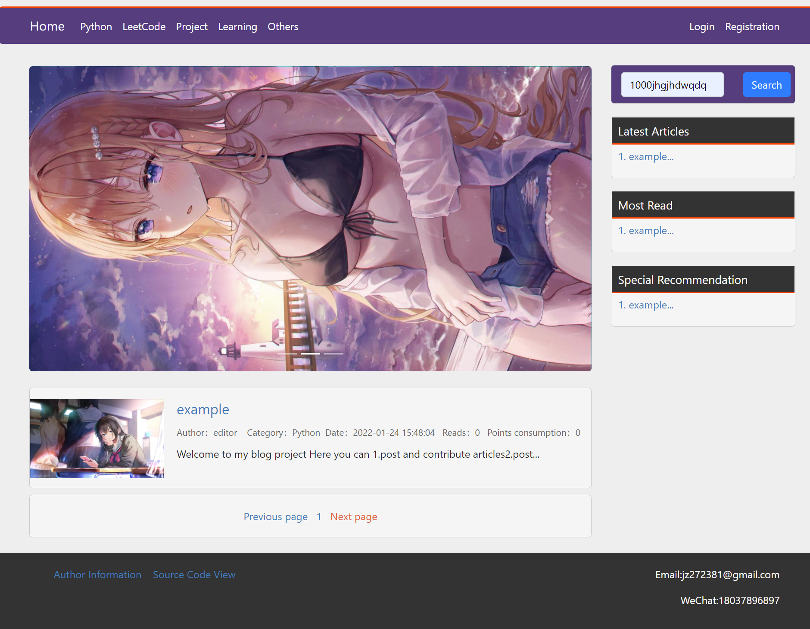
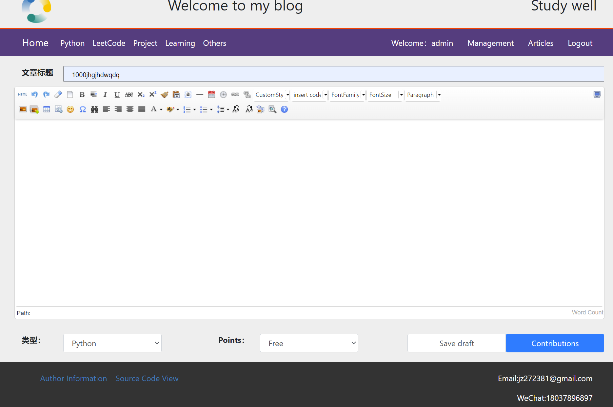
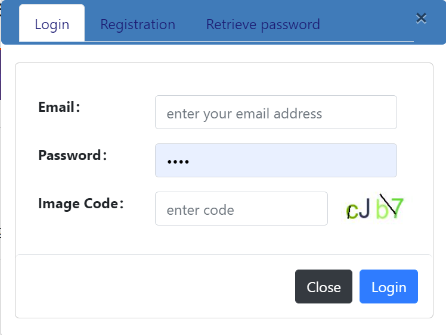

# pythonBlog

#### Project Description

This project is a personal blog project based on flask

It is relatively simple, but very functional, and more importantly: it is very easy to build, and is perfect for newbies
to learn

#### running method

1. Make sure you have a working MySql service

2. Download the project locally, you can use the following command

    ```git
    git clone https://github.com/sanxiadaba/pythonBlog.git
    ```

3. Go to the ".env" file and configure the information about your server, where you need to fill in the database name,
   MySql port, account, password, port to run on, etc (there are instructions in the file)

4. run the program (the program will automatically initialize the database)

    ```
    python3 app.py
    ```

#### extra functions

- In the .env file, you can create an administrator and editor account for the initial experience of the project (the
  two users created by default have the following accounts and passwords)

   ```
   account: adminTest
   password adminTest
   
   account: editorTest
   password editorTest
   ```

- If you want to use the mailbox registration, login and other functions

    1. first select "USE_GMAIL_OR_QQMAIL" in the .env file (currently only QQMAIL and GMAIL are supported)

    2. "EMAIL_ACCOUNT" Fill in the corresponding mailbox account

    3. Note that "EMAIL_PASSWORD" is not the password of your mailbox, but the authorization code of the corresponding
       mailbox

    - If you are QQ mailbox, go to Settings-->Account and open SMTP service, then generate authorization code
    - If you are a Google mailbox, then open the "Security" option in your Google account, turn on the two-step
      verification first, and then generate the application-specific password

#### Project screenshot

| Index Page                       | Article Page                       | Post Article                       |
| -------------------------------- | ---------------------------------- | ---------------------------------- |
|  |  |  |

| Manage Page                       | Login Panel                     |
| -------------------------------- | ----------------------------------|
|  | |

#### project structure diagram

````
.
├── . /.img 					# Store the image displayed by the readme
├─ . /common 					# Functions for some common functions
│ ├── . /connectDb.py 			        # Connect to the database
│ ├── . /myLog.py 				# Configure logs
│ ...
│
├─ . /controler 				# Controller for different pages
| ├── . /article.py 			        # The corresponding control for the article page
| ...
| /controler
├─ . /static 					# Store static resources
| ├── . /img 					# Save images such as avatars, post thumbnails, etc.
| ...
| ...
├─ . /database 					# Specify database operations
| ├── . /credit.py 				# Operate on the credit table
| ...
| ...
├─ . /logs 					# Store the logs
├─ . /.env 					# Environment configuration
├── . /constant.py 				# Page related parameter settings
├─ . /requirements.txt 			        # Packages to be installed for the project
├─ . /README.md
├─ . /LICENCE	
├─ . /gitignore		
├─ . /myBlog.sql 				# The sql file needed to initialize the database
├─ . /app.py 					# The entry program for the project
````

#### Required packages

You can install the required dependencies for this project directly using the following command

````python
pip3 install -r requirements.txt
````

#### project features

1. very friendly to newcomers, almost every part of the code has detailed comments, and the use of many technologies (
   such as bootstrap, sqlalchemy), part of the project (the sidebar of the home page and the article comments) using
   front and back-end separation technology, suitable for learning
2. a more complete blog system, the project interface is not beautiful, but can be said to be "small, but all the guts",
   to achieve a blog most of the functions. For example: collect articles, reply comments, article recommendation,
   article submission, article upload local pictures, modify avatar, draft save, email registration, retrieve password,
   background management, etc.
3. perfect logging system, in fact, logging I spent a lot of effort. The log log of this project can track almost all
   the actions of users, authors, administrators, to facilitate your data analysis related work later (log function
   based on loguru)
4. highly customizable, you can set a lot of features in constant.py file, such as: how many points you get for logging
   in every day, the maximum number of comments per person per day, whether to rotate the image, where to click on the
   rotating image, how many articles per page, etc.
5. stable update rate, this project will be updated and maintained in recent time, in fact, I would like to add many
   other new features, you are welcome to raise issues or pr to make the project better. My email is jz272381@gmail.com
   If you have any questions, please contact me, I will reply as soon as possible, of course, you are welcome to
   participate in the development.

#### may report errors

1. urllib version is too high, suggest lowering the version pip install urllib3==1.25.11

#### version update

- 21-12-8
    - The project is basically working, but there are still many flaws
- 21-1-15
    - Project is basically running
    - All the comments of the files are added
    - Comments for each field of the database are added
    - The main page of user background is written.
    - Implemented daily auto-detection of login and points collection function
- 21-1-24
    - Fixed the bug that you can favorite articles and reply comments when you are not logged in.
    - The database can be initialized automatically in the background.

#### Related links

- bootstrap[](https://getbootstrap.com/)
- flask[](https://flask.palletsprojects.com/en/2.0.x/)
- sqlalchemy[](https://docs.sqlalchemy.org/en/13/dialects/mysql.html)
- loguru[](https://github.com/Delgan/loguru)

#### Features to be developed

- Test Interface

- Administrator's user management page
- github third party login function
- redis caching technology
- flask-limiter limit
- flask backend monitoring
- markdown editor support

